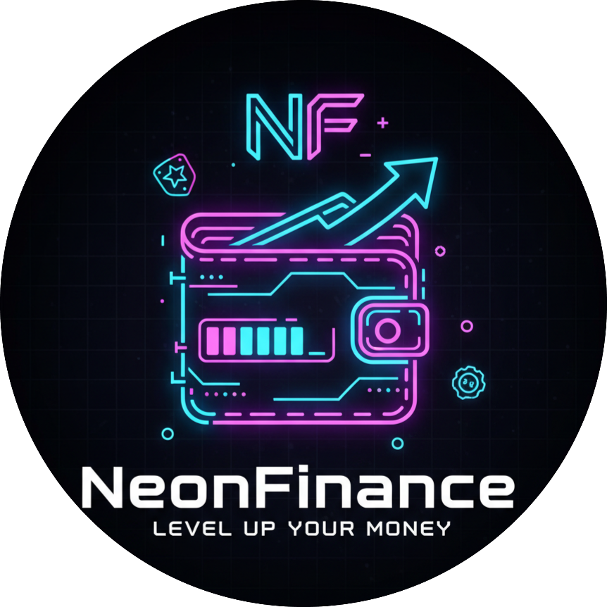

# NeonFinance - Personal Finance Management App 💰✨

<div align="center">
  
  
  [](https://flutter.dev)
  [](https://dart.dev)
  [](LICENSE)
</div>

## 📱 Download APK

**[Download NeonFinance APK](https://drive.google.com/drive/folders/1M2ZVOX9SZvWVafNpF0iPBcOE92oMsanX)**

> Download the latest version from Google Drive and install on your Android device.

## 🎯 About

NeonFinance is a modern personal finance management application with a stunning neon-themed UI and gamification features. Track your expenses, manage budgets, set financial goals, and visualize your spending patterns with beautiful charts and analytics.

## ✨ Features

- 💸 **Transaction Management** - Track income and expenses with detailed categorization
- 📊 **Budget Planning** - Set monthly budgets and monitor spending limits
- 🎯 **Financial Goals** - Create and track savings goals with progress visualization
- 📈 **Analytics & Reports** - Beautiful charts and insights about your spending habits
- 🎮 **Gamification** - Earn XP, level up, and unlock achievements
- 👤 **User Profile** - Manage your personal information and preferences
- 💳 **Multi-Wallet Support** - Organize finances across multiple wallets
- 🌍 **Multi-Language** - Support for Indonesian and English
- 🎨 **Neon Theme** - Eye-catching cyberpunk-inspired design

## 🚧 Development Status

**This app is currently under active development.** 

We are continuously working on improving features, user experience, and overall functionality. Some features may not be fully polished or may be subject to change in future updates. Your feedback and suggestions are highly appreciated!

## 🛠️ Tech Stack

- **Framework:** Flutter 3.5.0
- **Language:** Dart 3.5.0
- **State Management:** Riverpod
- **Routing:** GoRouter
- **Local Storage:** Hive
- **Charts:** FL Chart
- **UI Components:** Custom Neon-themed widgets with Shadcn-inspired design

### Prerequisites

- Flutter SDK (>=3.5.0)
- Dart SDK (>=3.5.0)
- Android Studio / VS Code
- Android device or emulator (minSdk 24)


## 🎨 Features in Detail

### Transaction Management
- Add, edit, and delete transactions
- Categorize expenses (Food, Transport, Shopping, etc.)
- Filter by date range and category
- Search functionality
- Income and expense tracking

### Budget Planning
- Set monthly budgets per category
- Real-time budget monitoring
- Visual progress indicators
- Budget alerts and notifications

### Financial Goals
- Create custom savings goals
- Track progress with visual indicators
- Set target amounts and deadlines
- Goal completion celebrations

### Analytics
- Expense breakdown by category
- Monthly spending trends
- Income vs Expense comparison
- Interactive charts and graphs

### Gamification
- Experience points (XP) system
- User levels and progression
- Achievement badges
- Daily/weekly challenges

## 🗂️ Project Structure
```
lib/
├── core/                    # Core utilities and configurations
│   ├── theme/              # App theme and colors
│   ├── router/             # Navigation and routing
│   ├── widgets/            # Reusable widgets
│   └── providers/          # Global providers
├── features/               # Feature modules
│   ├── auth/              # Authentication
│   ├── dashboard/         # Home dashboard
│   ├── transactions/      # Transaction management
│   ├── budget/            # Budget planning
│   ├── goals/             # Financial goals
│   ├── analytics/         # Charts and analytics
│   ├── gamification/      # XP and achievements
│   ├── profile/           # User profile
│   ├── wallet/            # Wallet management
│   └── settings/          # App settings
└── l10n/                  # Localization files
```

## 🌐 Localization

Supported languages:
- 🇮🇩 Indonesian (Bahasa Indonesia)
- 🇬🇧 English

---

<div align="center">
  Made with ❤️ by Vico Triansyah
  
  ⭐ Star this repo if you like it!
</div>